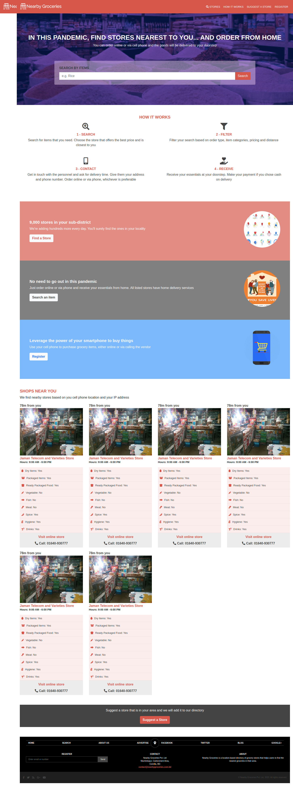

# bootstrap-nearby-groceries
This is a grocery stores directory built using Bootstrap 4 Sass and Flexbox based on [Mathew Njuguna](https://www.behance.net/mathewnjuguna) and [Sam Achola](https://www.behance.net/aweSam)'s design [here](https://www.behance.net/gallery/25563385/PatashuleKE)

There are three pages: the main page, a search results page and a store/item details page.

## Built With

- HTML5,
- CSS3,
- Sass,
- Bootstrap 4,
- jQuery,
- FontAwsome

## Live Demo

[Live Demo Link](https://rawcdn.githack.com/anewman15/bootstrap-nearby-groceries/943413c97a101dec408435d6571ee0600e390fec/index.html)

## Authors

👤 **Abdullah Numan**

- Github: [@anewman15](https://github.com/anewman15)
- Twitter: [@aanuman15](https://twitter.com/aanuman15)
- Linkedin: [aanuman15](https://www.linkedin.com/in/aanuman15/)

## 🤝 Contributing

Contributions, issues and feature requests are welcome!

Feel free to check the [issues page](/issues).

## Show your support

Give a ⭐️ if you like this project!

## Acknowledgments

- [Mathew Njuguna](https://www.behance.net/mathewnjuguna) and [Sam Achola](https://www.behance.net/aweSam) for their design [here](https://www.behance.net/gallery/25563385/PatashuleKE)
- https://www.w3schools.com/
- https://www.theodinproject.com/
- https://www.stackoverflow.com/
- https://fontawesome.com/